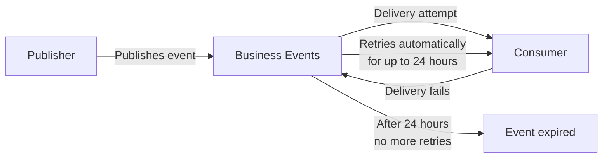

# Handling Retries

Business Events includes built-in retry behavior. If delivery does not succeed on the first attempt, the platform automatically retries for up to **24 hours**. After that window, the event is no longer retried.

This means retry handling is **fully managed** — you do not need to implement retry logic in your publisher or consumer.

## How it works



## What this means for publishers

Your publish call succeeds as soon as the platform accepts the event. You do not need to:

- Implement exponential backoff
- Track delivery status
- Re-publish on failure

```python
# This is all you need — no retry wrapper required
notebookutils.businessEvents.publish(
    workspace, schema_set, event_type, event_data, dataVersion="v1"
)
```

## What this means for consumers

Consumers should be **idempotent** — designed to handle receiving the same event more than once without side effects. Because the platform retries on delivery failure, a consumer that partially processed an event and then failed may receive it again.

### Making consumers idempotent

Use the CloudEvents `id` field (available in the envelope) as a deduplication key:

```kql
// In Eventhouse — check if event was already processed
['Retail.Inventory.LowStockThreshold']
| where id == "a8f3c1d2-..."
| count
```

For Activator, idempotency is handled naturally — the alert condition evaluates each event independently.

## Retry window considerations

| Scenario | Recommendation |
|----------|---------------|
| Event represents a time-sensitive signal (e.g., fraud alert) | Design consumers to process quickly; stale delivery within 24h may still be actionable |
| Event drives a one-time action (e.g., send email) | Make the action idempotent or check for duplicates before acting |
| Consumer is temporarily unavailable | Events will be retried — no publisher changes needed |
