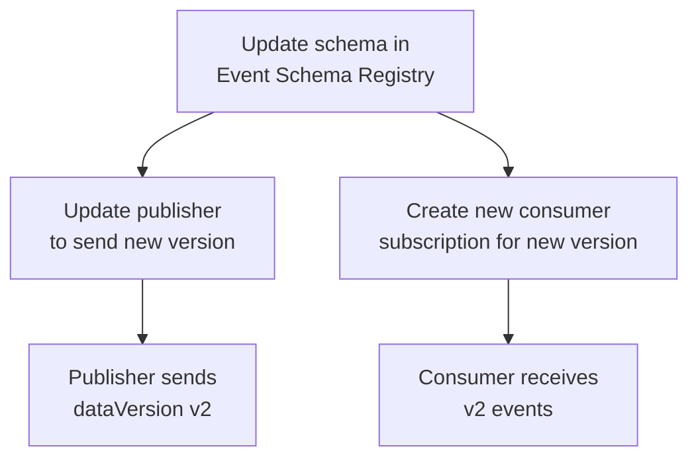

# Schema Versioning

Business Event schemas can evolve over time. This pattern covers how to update a schema and what changes are required on both the publisher and consumer side.

## Where schemas live

Schemas are stored as **Event Schemas** inside an **Event Schema Set** in the Event Schema Registry. When you create a Business Event from Real-Time Hub, a schema is created automatically in the associated schema set.

To evolve a schema:

1. Go to the **Event Schema Set** in the Event Schema Registry
2. Open the schema you want to update
3. Add, modify, or remove fields
4. Save the new version — the platform increments the version number automatically

## What changes after a schema update

A schema update does **not** propagate automatically to publishers or consumers. Both sides must be updated explicitly.



### Publisher update

The publisher must send the new `dataVersion` and include any new or changed fields in the payload:

```python
# Before — v1
event_data = {
    "store_id": "STR-001",
    "product_id": "SKU-9821",
    "current_qty": 4
}
notebookutils.businessEvents.publish(
    workspace, schema_set, event_type, event_data, dataVersion="v1"
)

# After — v2 adds threshold_pct field
event_data = {
    "store_id": "STR-001",
    "product_id": "SKU-9821",
    "current_qty": 4,
    "threshold_pct": 0.15       # new field in v2
}
notebookutils.businessEvents.publish(
    workspace, schema_set, event_type, event_data, dataVersion="v2"
)
```

### Consumer update

Each consumer subscription is tied to a specific schema version. To consume the new version:

- **Activator** — create a new alert rule targeting the updated Business Event
- **Eventhouse** — a new KQL table is created for the new version; update your queries to reference it

!!! warning "Existing subscriptions keep receiving the old version"
    Subscriptions created for `v1` continue to receive `v1` events. They do not automatically upgrade to `v2`. You must create new subscriptions and migrate consumers deliberately.

## Versioning strategy

| Approach | When to use |
|----------|-------------|
| **Additive change** (add new optional fields) | Safe — existing consumers ignore unknown fields |
| **Breaking change** (rename or remove fields) | Requires new version and explicit consumer migration |
| **Parallel versions** (run v1 and v2 simultaneously) | Use during migration; decommission v1 once all consumers are updated |

## Recommendations

**Start with `v1` from day one.** Always publish with an explicit `dataVersion` so you have room to evolve without disruption.

**Prefer additive changes.** Adding new optional fields to a schema is the least disruptive path — consumers that do not need the new fields continue working without changes.

**Communicate version changes to consumers.** Because subscriptions do not auto-upgrade, consumer teams need to know when a new version is available so they can create updated subscriptions.
