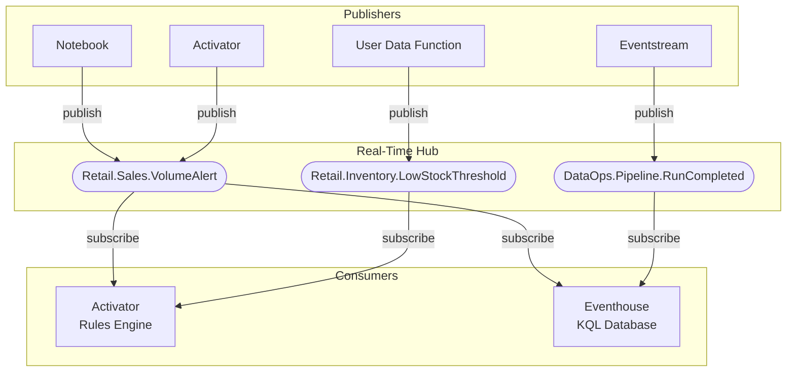
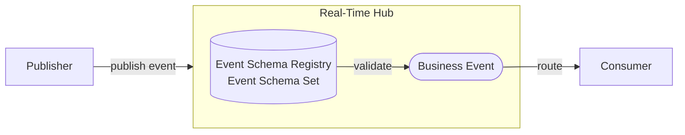
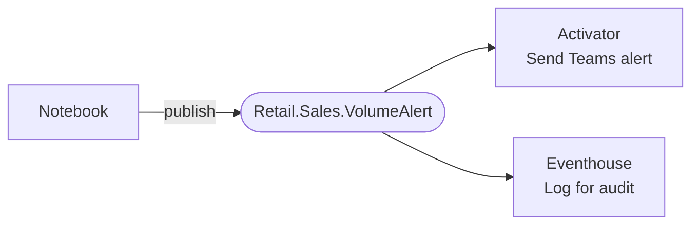

# Architecture Overview

Business Events connects publishers and consumers through Microsoft Fabric Real-Time Hub. This page explains how the components fit together.

## High-level architecture

## Event Schema Registry

The **Event Schema Registry** is a platform-level capability in Microsoft Fabric that stores and validates all schema definitions. Business Events are a special type of event schema stored in the registry, organized into **Event Schema Sets**.

Business Events cannot be created directly from the Event Schema Registry. They must be created from **Real-Time Hub → Business Events**. During creation, you can create a new Event Schema Set inline or select an existing one. The Event Schema Registry is the underlying storage; Real-Time Hub → Business Events is the entry point.

Before publishing, go to [Real-Time Hub → Business Events](https://learn.microsoft.com/en-us/fabric/real-time-hub/business-events/create-business-events) and create your Business Event from there. You will be prompted to create or select an Event Schema Set as part of the flow.

## Component roles

### Publishers
Any workload that detects a meaningful condition and signals it to the rest of the platform.

| Publisher | Best suited for |
|-----------|----------------|
| **[Notebook](https://learn.microsoft.com/en-us/fabric/data-engineering/how-to-use-notebook)** | Batch analysis results, data quality checks, scheduled monitoring |
| **[User Data Function](https://learn.microsoft.com/en-us/fabric/data-engineering/user-data-functions/user-data-functions-overview)** | External webhook normalization, custom integrations |
| **[Eventstream](https://learn.microsoft.com/en-us/fabric/real-time-intelligence/event-streams/overview)** | Real-time stream threshold conditions |
| **[Activator](https://learn.microsoft.com/en-us/fabric/real-time-intelligence/activator/activator-introduction)** | Re-publishing derived events from existing rules |

### Real-Time Hub
The managed service in Microsoft Fabric Real-Time Intelligence that receives, routes, and delivers Business Events. Publishers write to it; consumers read from it. Real-Time Hub holds the schema registry for all defined Business Events.

### Consumers
Workloads that subscribe to one or more Business Events and react when a matching event arrives.

| Consumer | Best suited for |
|----------|----------------|
| **[Activator](https://learn.microsoft.com/en-us/fabric/real-time-intelligence/activator/activator-introduction)** | Triggering alerts, notifications, or downstream actions based on event conditions |
| **[Eventhouse](https://learn.microsoft.com/en-us/fabric/real-time-intelligence/eventhouse)** | Persisting events for historical analysis and KQL queries |

## One event, multiple consumers

A single Business Event can trigger reactions in multiple consumers simultaneously. Publishers do not need to change when new consumers are added.

This fan-out pattern is one of the key architectural advantages of Business Events over direct service-to-service calls.

