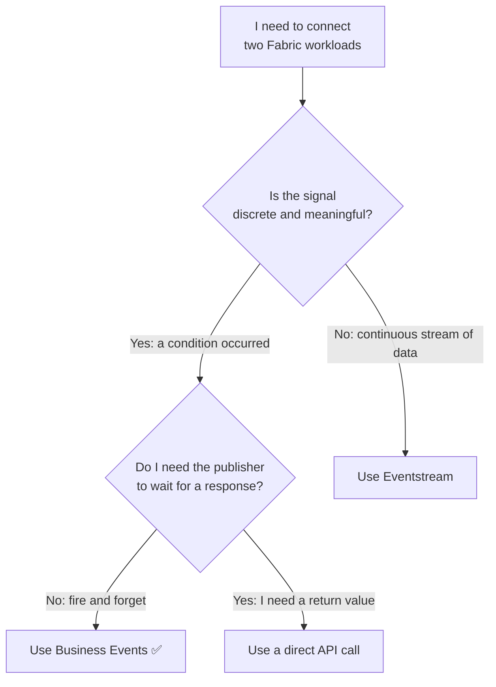

# Decision Guide

Microsoft Fabric Real-Time Intelligence offers multiple ways to connect workloads and move data between services. Use this guide to choose the right approach for your scenario.

## Capabilities at a glance

| Capability | What it is | Best for |
|---|---|---|
| **[Business Events](https://learn.microsoft.com/en-us/fabric/real-time-hub/business-events/business-events-overview)** | Schema-defined signals published by Fabric workloads to Real-Time Hub | Discrete, meaningful occurrences that trigger reactions across multiple consumers |
| **[Eventstream](https://learn.microsoft.com/en-us/fabric/real-time-intelligence/event-streams/overview)** | High-throughput streaming pipeline for continuous data | IoT telemetry, clickstreams, logs, and any high-volume continuous data |
| **[Activator](https://learn.microsoft.com/en-us/fabric/real-time-intelligence/activator/activator-introduction)** | Rules engine that monitors data and triggers actions | Reacting to conditions in streams or Business Events without writing code |
| **Direct API call** | Synchronous call from one workload to another | When you need an immediate response from the called service |

## Should I use Business Events?

## When to use each option in Fabric

**Use Business Events when:**

- A Notebook finishes a transformation and Activator or Eventhouse need to react
- A threshold condition is detected and multiple Fabric workloads need to be notified independently
- You want to add a new consumer (Activator rule, Eventhouse table) without modifying the publisher
- You need a schema contract that enforces what data the event carries

**Use Eventstream when:**

- You are ingesting continuous data from IoT sensors, event producers, or external systems
- You need to process or route high-volume data streams in real time
- The data is a stream, not a discrete signal

**Use Activator directly when:**

- You want to monitor an existing Eventstream or Eventhouse table for conditions
- You need to trigger alerts or actions without publishing an explicit event
- The reaction logic lives entirely within Activator

**Use a direct API call when:**

- You need a synchronous response from another Fabric workload or external service
- The integration is tightly scoped and unlikely to gain additional consumers
