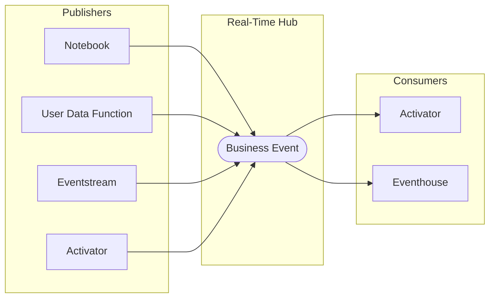

# What are Business Events?

A Business Event represents a significant occurrence or change-in-state that matters to the business. Unlike raw telemetry or diagnostic data, Business Events are intentionally modeled around business outcomes: driving critical decisions, automating workflows, triggering alerts, enabling analytics, and providing real-time context to AI.

## The core idea

In most data platforms, workloads communicate through **direct calls**: one service invokes another, waits for a response, and fails if the other is unavailable. This creates **tight coupling** that makes systems fragile and hard to evolve.

Business Events introduce a different model. Any **publisher** (a [Notebook](https://learn.microsoft.com/en-us/fabric/data-engineering/how-to-use-notebook), a [User Data Function](https://learn.microsoft.com/en-us/fabric/data-engineering/user-data-functions/user-data-functions-overview), an [Eventstream](https://learn.microsoft.com/en-us/fabric/real-time-intelligence/event-streams/overview), or [Activator](https://learn.microsoft.com/en-us/fabric/real-time-intelligence/activator/activator-introduction)) can emit a named, schema-defined event to **[Real-Time Hub](https://learn.microsoft.com/en-us/fabric/real-time-hub/real-time-hub-overview)** the moment something meaningful happens. Any number of **consumers** ([Activator](https://learn.microsoft.com/en-us/fabric/real-time-intelligence/activator/activator-introduction) or [Eventhouse](https://learn.microsoft.com/en-us/fabric/real-time-intelligence/eventhouse)) react to that event independently, without the publisher knowing who is listening or how many are subscribed.

This means you can add new consumers, change how alerts are delivered, or route the same event to an analytics store, all without touching the code that published the event.

## Key concepts

**Schema-first design**
Every Business Event has a defined schema before any data flows. The schema uses a record format with typed fields, ensuring consumers always know what to expect.

**Decoupled architecture**
Publishers do not know who consumes their events. Consumers do not know who publishes. This means you can add new consumers without changing any publisher code.

**Real-time delivery**
Events are delivered to consumers in real time through Microsoft Fabric Real-Time Hub infrastructure.

## Next steps

- [Architecture Overview](architecture-overview.md): understand how the pieces fit together
- [Event Schema](event-schema.md): learn the schema format and field types
- [Decision Guide](decision-guide.md): when to use Business Events vs alternatives
