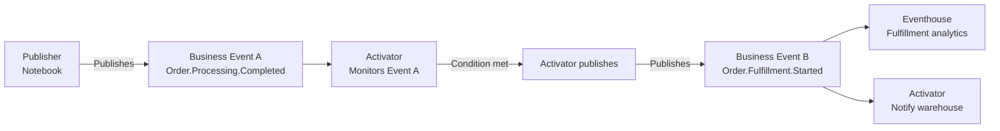

# Chain Two Business Events

Use the output of one Business Event as the trigger for publishing a second Business Event. This creates a lightweight event chain where each step signals the next.

## When to use this recipe

Use event chaining when a business process has sequential stages and each stage has independent consumers. Chaining keeps each stage loosely coupled — the first publisher does not need to know what happens next.

## Architecture



## Step 1: Publish the first event

```python
# Notebook publishes Event A when order processing completes
event_data = {
    "order_id": "ORD-4421",
    "customer_id": "CUST-882",
    "total_amount": 340.00,
    "completed_at": "2024-11-15T14:32:00Z"
}

notebookutils.businessEvents.publish(
    "MyWorkspace",
    "OrderProcessing",
    "Order.Processing.Completed",
    event_data,
    dataVersion="v1"
)
```

## Step 2: Configure Activator to publish Event B

1. Go to **Real-Time Hub → Business events**
2. Find **Order.Processing.Completed** and click **Set alert**
3. Configure **Monitor**: source = Order.Processing.Completed
4. Configure **Condition**: On each event
5. Configure **Action**: Publish a business event
6. Select **Order.Fulfillment.Started** as the target event
7. Map fields from Event A to Event B:

| Event A field | Event B field |
|---------------|---------------|
| `order_id` | `order_id` |
| `customer_id` | `customer_id` |
| *(static value)* | `started_at` → current timestamp |

## Design considerations

**Keep chains short.** Each hop adds latency and a potential failure point. If you need more than 2-3 steps, consider whether an orchestration tool (Data Pipeline, Power Automate) is a better fit.

**Each event should be independently meaningful.** If Event B is only ever triggered by Event A and has no other consumers, evaluate whether two separate events are necessary.

**Do not create circular chains.** Event A triggering Event B triggering Event A will cause an infinite loop. Design chains to always move forward in the process.
