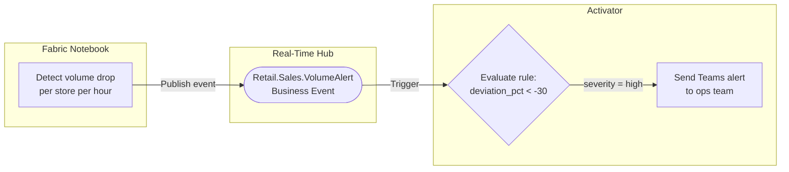
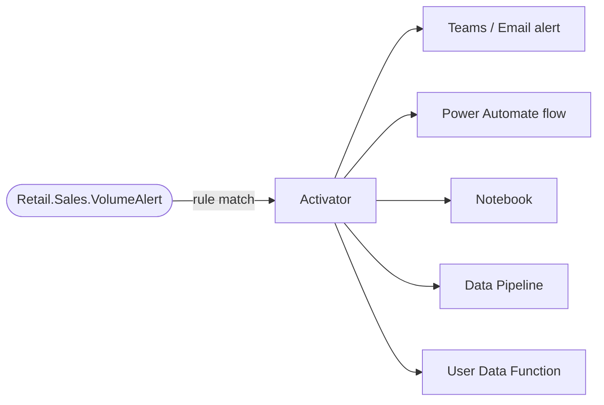

# Scenario 1: Sales Volume Alert

**Publisher:** Notebook | **Consumer:** Activator

## Business context

A retail company runs daily sales processing in Microsoft Fabric. Each store is expected to process a baseline number of transactions per hour based on historical data. If a store's transaction volume drops significantly below its expected baseline, it may indicate a failure in the point-of-sale integration, not a natural slowdown.

The operations team needs to be notified automatically when this condition is detected, without relying on a human to monitor dashboards.

**The problem without Business Events:**
The notebook that detects the condition would need to call a notification service directly, creating a hard dependency. If the notification service changes, the notebook code must change too.

**The solution with Business Events:**
The notebook publishes a `Retail.Sales.VolumeAlert` event. Activator subscribes to that event and triggers the notification. The notebook does not know or care how the alert is delivered.

## Architecture



## Step 1: Create the Business Event

Before publishing any event, you need to define it in Real-Time Hub.

1. Go to [Real-Time Hub → Business Events → Create](https://learn.microsoft.com/en-us/fabric/real-time-hub/business-events/create-business-events).
2. Create or select an Event Schema Set. Use `RetailSales` as the schema set name. Note the name and workspace. They map directly to `SCHEMA_SET_NAME` and `WORKSPACE_NAME` in the publisher code.
3. Name the event `Retail.Sales.VolumeAlert`.
4. In the schema editor, paste the following JSON and select **Create**:

```json
{
  "type": "record",
  "name": "Retail.Sales.VolumeAlert",
  "fields": [
    {
      "name": "store_id",
      "type": "string",
      "doc": "Unique identifier of the store reporting the alert"
    },
    {
      "name": "expected_transactions",
      "type": "int",
      "doc": "Expected number of transactions based on historical average"
    },
    {
      "name": "actual_transactions",
      "type": "int",
      "doc": "Actual transactions recorded in the current monitoring window"
    },
    {
      "name": "deviation_pct",
      "type": "float",
      "doc": "Percentage deviation from expected volume. Negative means below expected."
    },
    {
      "name": "window_start",
      "type": "string",
      "doc": "Start of the monitoring window in ISO 8601 format"
    },
    {
      "name": "severity",
      "type": "string",
      "doc": "Alert severity level: low, medium, high"
    }
  ]
}
```

## Step 2: Publisher - Notebook

The notebook queries the sales data, calculates the deviation per store, and publishes a Business Event for each store that exceeds the threshold.

### Create the Notebook

1. In your Fabric workspace, select **+ New item** and create a **Notebook**.
2. Attach it to a Lakehouse that contains your sales data, or use the hardcoded values provided below for testing.

### Notebook code

Replace `WORKSPACE_NAME` with your Fabric workspace name and `SCHEMA_SET_NAME` with the name of the Event Schema Set associated with the Business Event you created in [Real-Time Hub → Business Events](https://learn.microsoft.com/en-us/fabric/real-time-hub/business-events/create-business-events).

```python
# Publish a Retail.Sales.VolumeAlert Business Event from a Fabric Notebook
# notebookutils reference: https://learn.microsoft.com/en-us/fabric/data-engineering/microsoft-spark-utilities

WORKSPACE_NAME = "<your-workspace-name>"
SCHEMA_SET_NAME = "<your-schema-set-name>"
EVENT_NAME = "Retail.Sales.VolumeAlert"

# Calculate deviation for a store
store_id = "store-mx-042"
expected = 1250
actual = 743
deviation_pct = round(((actual - expected) / expected) * 100, 2)
severity = "high" if deviation_pct < -30 else "medium" if deviation_pct < -15 else "low"

# Build the event payload
payload = {
    "store_id": store_id,
    "expected_transactions": expected,
    "actual_transactions": actual,
    "deviation_pct": deviation_pct,
    "window_start": "2024-06-22T09:00:00Z",
    "severity": severity
}

# Publish to Business Events
notebookutils.businessEvents.publish(
    eventSchemaSetWorkspace=WORKSPACE_NAME,
    eventSchemaSet=SCHEMA_SET_NAME,
    eventTypeName=EVENT_NAME,
    eventData=payload,
    dataVersion="v1"
)
```

## Step 3: Consumer - Activator

When the `Retail.Sales.VolumeAlert` Business Event is published to Real-Time Hub, Activator can subscribe to it and trigger an action when the rule condition is met.

### Set up the alert rule

1. In Microsoft Fabric, navigate to **Real-Time** on the left navigation bar.
2. Select **Business events** in Real-Time Hub.
3. Locate the `Retail.Sales.VolumeAlert` event under your schema set.
4. Select **Set alert** from the event options.

### Configure the rule

**Details section**

Enter a name for the rule, for example: `Sales Volume Drop Alert`.

**Monitor section**

1. In the **Source** field, select **Business events**.
2. In the **Connect data source** wizard, select the `Retail.Sales.VolumeAlert` event type.
3. Select **+ Filter** and configure the following filter:
    - Field: `deviation_pct`
    - Operator: `Less than`
    - Value: `-30`
4. Select **Next**, review the settings, and select **Save**.

**Condition section**

Set **Check** to `On each event`.

**Action section**

1. For **Select action**, choose `Teams` then `Channel post`.
2. Configure the Teams channel to notify the operations team.
3. In **Context**, add `store_id`, `actual_transactions`, and `deviation_pct` so the alert includes the relevant details.

## Step 4: End-to-end test

Once you have the Business Event defined, the notebook configured, and the Activator rule in place, run the notebook as-is. The hardcoded values for `store-mx-042` produce a `deviation_pct` of `-40.56`, which exceeds the `-30` threshold and should trigger the Teams alert.

If the alert fires, your end-to-end setup is working. You can then replace the hardcoded values with real sales data from your Fabric lakehouse or warehouse.

## What happens next

When Activator receives the `Retail.Sales.VolumeAlert` event and the rule condition is met, it can trigger one or more actions. This scenario uses a Teams alert, but Activator supports additional action types that you can combine or substitute.



| Action | When to use |
|---|---|
| **Teams / Email alert** | Notify a team or individual immediately when the condition is met |
| **Power Automate flow** | Trigger a business process or approval workflow outside Fabric |
| **Notebook** | Run a remediation or deeper analysis in response to the event |
| **Data Pipeline** | Kick off a downstream data processing job |
| **User Data Function** | Call custom logic or an external API |

For full details on configuring each action type, see the [Activator documentation](https://learn.microsoft.com/fabric/real-time-intelligence/activator/activator-introduction).


