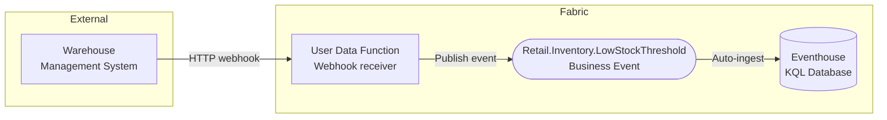
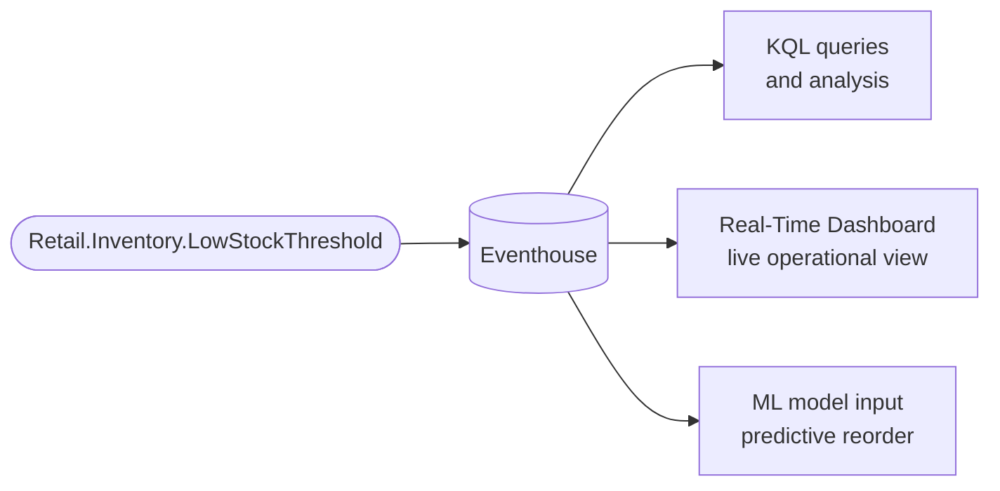

# Scenario 2: Low Stock Threshold

**Publisher:** User Data Function | **Consumer:** Eventhouse

## Business context

A retail company receives inventory updates from an external warehouse management system (WMS). When a product's stock drops below the reorder threshold, the WMS sends a webhook to a User Data Function in Microsoft Fabric. The function normalizes the payload and publishes a `Retail.Inventory.LowStockThreshold` Business Event.

Eventhouse automatically stores every event as a queryable record. The inventory team uses KQL to identify which products breach thresholds most frequently, track patterns over time, and build reorder predictions.

**The problem without Business Events:**
The User Data Function would need to call the inventory system, the analytics store, and any notification service directly. Each integration is a hard dependency that breaks if the downstream system changes.

**The solution with Business Events:**
The User Data Function publishes one event. Eventhouse stores it automatically. Any additional consumer can be added later without touching the function.

## Architecture



## Step 1: Create the Business Event

Before publishing any event, define it in Real-Time Hub. Eventhouse integration is enabled by default during this step.

1. Go to [Real-Time Hub → Business Events → Create](https://learn.microsoft.com/en-us/fabric/real-time-hub/business-events/create-business-events).
2. Create or select an Event Schema Set. Use `RetailInventory` as the schema set name. You will need this name later when connecting the Event Schema Set to the User Data Function through the connection manager.
3. Name the event `Retail.Inventory.LowStockThreshold`.
4. In the schema editor, paste the following JSON:

    ```json
    {
      "type": "record",
      "name": "Retail.Inventory.LowStockThreshold",
      "fields": [
        {
          "name": "product_id",
          "type": "string",
          "doc": "Unique identifier of the product"
        },
        {
          "name": "product_name",
          "type": "string",
          "doc": "Display name of the product"
        },
        {
          "name": "store_id",
          "type": "string",
          "doc": "Identifier of the store or warehouse reporting the condition"
        },
        {
          "name": "current_stock",
          "type": "int",
          "doc": "Current units available at the time of detection"
        },
        {
          "name": "threshold",
          "type": "int",
          "doc": "Minimum stock level that triggered this alert"
        },
        {
          "name": "supplier_id",
          "type": "string",
          "doc": "Identifier of the preferred supplier for reordering"
        },
        {
          "name": "detected_at",
          "type": "string",
          "doc": "Timestamp when the condition was detected, ISO 8601 format"
        }
      ]
    }
    ```

5. Confirm that **Analyze in Eventhouse** is enabled. Create a new Eventhouse or select an existing one in your workspace. This creates a dedicated KQL table for this Business Event automatically. No additional ingestion configuration is needed.
6. Select **Create**.

## Step 2: Publisher - User Data Function

The User Data Function receives a webhook from the external WMS and publishes the Business Event.

### Create the User Data Function

1. In your Fabric workspace, select **+ New item** and create a **User Data Function** named `PublishLowStockEvent`.
2. Inside the UDF item, select **New function**.

### Connect to the schema set

Before writing the code, you need to connect the function to the Event Schema Set.

3. In the **Home** ribbon, select **Manage connections**.
4. In the **Connections** pane, select **+ Add connection**.
5. Search for `RetailInventory`, select the schema set, and select **Connect**.
6. An alias is automatically generated using the schema set name (`RetailInventory` by default). Add this alias to the `@udf.connection` decorator in your function code.
7. Close the **Manage connections** pane.

### Function code

Replace the default function code with the following. For full details on publishing Business Events from User Data Functions, see the [User Data Function publisher documentation](https://learn.microsoft.com/en-us/fabric/real-time-hub/business-events/business-events-user-data-function) and the [end-to-end tutorial](https://learn.microsoft.com/en-us/fabric/real-time-hub/business-events/tutorial-business-events-user-data-function-activation-email).

```python
import fabric.functions as fn
import logging

udf = fn.UserDataFunctions()

# The alias must match the connection configured in Manage connections
@udf.connection(argName="businessEventsClient", alias="RetailInventory")
@udf.function()
def publish_low_stock_event(
    businessEventsClient: fn.FabricBusinessEventsClient,
    product_id: str,
    product_name: str,
    store_id: str,
    current_stock: int,
    threshold: int,
    supplier_id: str,
    detected_at: str
) -> str:
    logging.info("publish_low_stock_event invoked.")

    event_data = {
        "product_id": product_id,
        "product_name": product_name,
        "store_id": store_id,
        "current_stock": current_stock,
        "threshold": threshold,
        "supplier_id": supplier_id,
        "detected_at": detected_at
    }

    businessEventsClient.PublishEvent(
        type="Retail.Inventory.LowStockThreshold",
        event_data=event_data,
        data_version="v1"
    )

    return "Event 'Retail.Inventory.LowStockThreshold' published successfully"
```

## Step 3: Consumer - Eventhouse

Because Eventhouse integration was enabled during Business Event creation, a dedicated KQL table was created automatically in your Eventhouse database. Every published event is ingested into that table with no additional configuration.

Open your Eventhouse KQL database and run the following queries to verify events are flowing and explore the data.

**View the most recent events:**

```kusto
['Retail.Inventory.LowStockThreshold']
| order by ingestion_time() desc
| take 50
```

**Count alerts per store over the last 7 days:**

```kusto
['Retail.Inventory.LowStockThreshold']
| where ingestion_time() > ago(7d)
| summarize AlertCount = count() by store_id
| order by AlertCount desc
```

**Identify products with recurring low stock:**

```kusto
['Retail.Inventory.LowStockThreshold']
| where ingestion_time() > ago(30d)
| summarize Occurrences = count(), AvgStock = avg(current_stock) by product_id, product_name
| where Occurrences > 3
| order by Occurrences desc
```

For more information, see [Eventhouse and Business Events integration](https://learn.microsoft.com/en-us/fabric/real-time-hub/business-events/business-events-eventhouse).

## Step 4: End-to-end test

Once you have the Business Event defined, the User Data Function connected, and the Eventhouse integration active, invoke the function with hardcoded values to verify the full flow.

Call `publish_low_stock_event` with the following test values:

| Parameter | Value |
|---|---|
| `product_id` | `prod-mx-7821` |
| `product_name` | `Wireless Keyboard` |
| `store_id` | `store-mx-042` |
| `current_stock` | `4` |
| `threshold` | `10` |
| `supplier_id` | `sup-451` |
| `detected_at` | `2024-06-22T09:00:00Z` |

Then run the following KQL query in your Eventhouse database and confirm the row appears:

```kusto
['Retail.Inventory.LowStockThreshold']
| where product_id == "prod-mx-7821"
| order by ingestion_time() desc
| take 1
```

If the row is present, your end-to-end setup is working. You can then configure the external WMS to call the User Data Function endpoint as a webhook.

## What happens next

With events persisted in Eventhouse, the inventory team can extend the solution without modifying the publisher.



| Extension | What it enables |
|---|---|
| **Real-Time Dashboard** | Live tile showing current low-stock alerts across all stores |
| **KQL scheduled query** | Daily summary of products below threshold sent to a report |
| **ML model input** | Historical event data as training features for reorder prediction |
| **Activator rule** | Add an alert action without changing the User Data Function |

For full details on querying and visualizing Business Events in Eventhouse, see the [Eventhouse integration documentation](https://learn.microsoft.com/en-us/fabric/real-time-hub/business-events/business-events-eventhouse).
