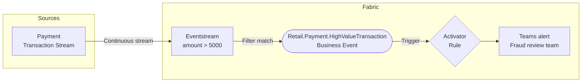
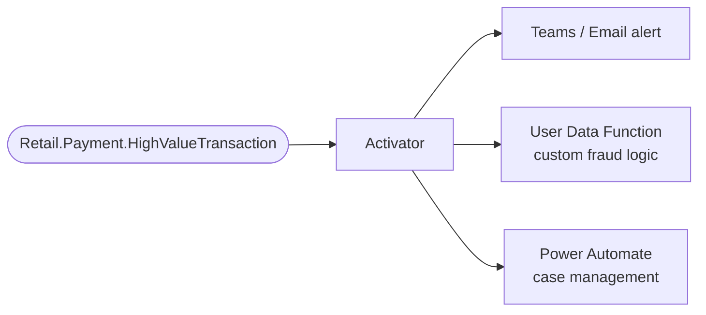

# Scenario 3: Real-Time Stream Alert

**Publisher:** Eventstream | **Consumer:** Activator

## Business context

A retail company processes a continuous stream of payment transactions from multiple stores and channels. Most transactions are routine, but high-value transactions above a defined threshold require immediate review by the fraud team.

Monitoring every transaction individually is not practical. Eventstream evaluates each record in the stream, applies a filter condition, and publishes a `Retail.Payment.HighValueTransaction` Business Event only when the threshold is exceeded. Activator subscribes to that event and notifies the fraud review team in real time.

**The problem without Business Events:**
Eventstream would need to route the filtered data directly to a notification endpoint, creating a hard dependency between the stream pipeline and the alerting system. Any change to the notification channel requires modifying the Eventstream configuration.

**The solution with Business Events:**
Eventstream publishes one event when the condition is met. Activator subscribes independently. The stream pipeline does not need to change when the alert destination changes.

## Architecture



## Step 1: Create the Business Event

Before configuring the Eventstream, define the Business Event in Real-Time Hub.

1. Go to [Real-Time Hub → Business Events → Create](https://learn.microsoft.com/en-us/fabric/real-time-hub/business-events/create-business-events).
2. Create or select an Event Schema Set. Use `RetailPayments` as the schema set name.
3. Name the event `Retail.Payment.HighValueTransaction`.
4. In the schema editor, paste the following JSON:

    ```json
    {
      "type": "record",
      "name": "Retail.Payment.HighValueTransaction",
      "fields": [
        {
          "name": "transaction_id",
          "type": "string",
          "doc": "Unique identifier of the payment transaction"
        },
        {
          "name": "payment_method",
          "type": "string",
          "doc": "Payment method used: credit_card, debit_card, or digital_wallet"
        },
        {
          "name": "amount",
          "type": "float",
          "doc": "Transaction amount in the store's local currency"
        },
        {
          "name": "currency",
          "type": "string",
          "doc": "ISO 4217 currency code, for example USD or MXN"
        },
        {
          "name": "store_id",
          "type": "string",
          "doc": "Identifier of the store where the transaction was processed"
        },
        {
          "name": "processed_at",
          "type": "string",
          "doc": "Timestamp when the transaction was processed, ISO 8601 format"
        }
      ]
    }
    ```

5. Select **Create**.

## Step 2: Publisher - Eventstream

Eventstream is configured entirely from the UI. There is no code to write. You apply a filter transformation to the transaction stream and route matching events to the Business Event destination.

### Create the Eventstream

1. In your Fabric workspace, select **+ New item** and create an **Eventstream** named `PaymentTransactionStream`.
2. In the Eventstream editor, add your payment transaction data source. Connect it to the stream that produces transaction records with at least the fields defined in the schema above.

### Add a filter transformation

3. On the **Transform events or add destination** card, select the down arrow and choose **Filter**.
4. Select the **Action** link on the Filter card.
5. In the **Filter** window, configure the following:
    - **Operation name**: `HighValueFilter`
    - **Field**: `amount`
    - **Condition**: `Greater than`
    - **Value**: `5000`
6. Select **Save**.

### Add the Business Events destination

7. On the **HighValueFilter** card, select **Action** or the **+** button.
8. In the list of destinations, select **Business events**.
9. On the Business events card, select the **Edit** (pencil icon).
10. In the **Business events** window:
    - For **Destination name**, enter `HighValueTransactionPublisher`.
    - For **Business event type**, select **Choose** and select `Retail.Payment.HighValueTransaction`.
11. Select **Save**.

### Map the schema fields

12. On the `Retail.Payment.HighValueTransaction` card, select **Add** next to **Add a mapper to map schema**.
13. In the **Map schema** window, verify that each stream field maps to the corresponding schema field, and select **Finish**.
14. Select **Publish** to activate the Eventstream.

For full details on configuring Eventstream as a Business Events publisher, see the [Eventstream publisher documentation](https://learn.microsoft.com/en-us/fabric/real-time-hub/business-events/business-events-event-stream-publisher) and the [end-to-end tutorial](https://learn.microsoft.com/en-us/fabric/real-time-hub/business-events/tutorial-business-events-event-stream-user-data-function-activator).

## Step 3: Consumer - Activator

When a `Retail.Payment.HighValueTransaction` event is published, Activator evaluates the rule and triggers a Teams alert to the fraud review team.

### Set up the alert rule

1. In Microsoft Fabric, navigate to **Real-Time** on the left navigation bar.
2. Select **Business events** in Real-Time Hub.
3. Locate the `Retail.Payment.HighValueTransaction` event under your schema set.
4. Select **Set alert** from the event options.

### Configure the rule

**Details section**

Enter a name for the rule, for example: `High Value Transaction Alert`.

**Monitor section**

1. In the **Source** field, select **Business events**.
2. In the **Connect data source** wizard, select the `Retail.Payment.HighValueTransaction` event type.
3. Select **Next**, review the settings, and select **Save**.

**Condition section**

Set **Check** to `On each event`.

**Action section**

1. For **Select action**, choose `Teams` then `Channel post`.
2. Configure the Teams channel for the fraud review team.
3. In **Context**, add `transaction_id`, `amount`, `store_id`, and `payment_method` so the alert includes the relevant details.

## Step 4: End-to-end test

Once you have the Business Event defined, the Eventstream published, and the Activator rule in place, verify the full flow.

1. In Real-Time Hub, select the `Retail.Payment.HighValueTransaction` event.
2. Go to the **Publisher** tab and confirm that `PaymentTransactionStream` is listed as an active publisher.
3. Switch to the **Data preview** tab, select the Eventstream publisher, and verify that event records are visible in the preview table.
4. Confirm that the Teams alert fires for each matching event.

If records appear in the data preview and the Teams alert fires, your end-to-end setup is working.

## What happens next

With the Eventstream filtering the stream and publishing discrete events, any new consumer can be added without modifying the pipeline.



| Extension | What it enables |
|---|---|
| **Teams / Email alert** | Immediate notification to the fraud review team |
| **User Data Function** | Run custom fraud scoring or call an external risk API |
| **Power Automate** | Open a case in your case management system automatically |
| **Eventhouse** | Store all high-value transactions for pattern analysis and model training |
