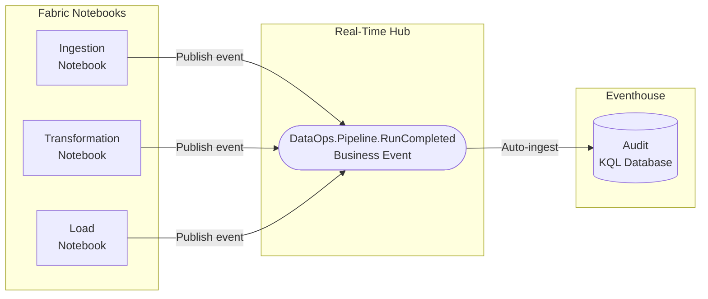
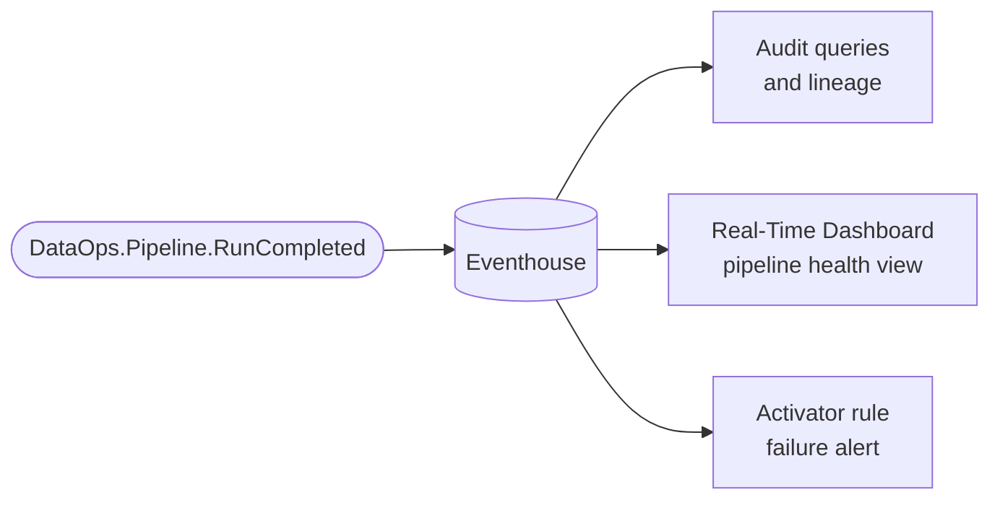

# Scenario 4: Data Lineage Audit

**Publisher:** Notebook | **Consumer:** Eventhouse

## Business context

A data engineering team runs a series of daily notebooks in Microsoft Fabric that ingest, transform, and load data across multiple domains. Each run must be auditable: when it ran, what it processed, whether it succeeded or failed, and who or what triggered it.

Without a centralized event record, the team relies on scattered logs across individual notebooks, making it difficult to trace lineage, identify recurring failures, or satisfy compliance requirements.

**The problem without Business Events:**
Each notebook would need to write audit records to a different store (Lakehouse table, log file, external API), creating inconsistent schemas and fragmented lineage data.

**The solution with Business Events:**
Every notebook publishes a `DataOps.Pipeline.RunCompleted` event at the end of its execution. Eventhouse stores every event automatically using a consistent schema, giving the team a unified, queryable audit trail across all pipelines.

## Architecture



## Step 1: Create the Business Event

Before publishing any event, define it in Real-Time Hub. Eventhouse integration is enabled by default during this step.

1. Go to [Real-Time Hub → Business Events → Create](https://learn.microsoft.com/en-us/fabric/real-time-hub/business-events/create-business-events).
2. Create or select an Event Schema Set. Use `DataOps` as the schema set name. Note the name and workspace. They map directly to `SCHEMA_SET_NAME` and `WORKSPACE_NAME` in the publisher code.
3. Name the event `DataOps.Pipeline.RunCompleted`.
4. In the schema editor, paste the following JSON:

    ```json
    {
      "type": "record",
      "name": "DataOps.Pipeline.RunCompleted",
      "fields": [
        {
          "name": "pipeline_id",
          "type": "string",
          "doc": "Unique identifier of the pipeline or notebook"
        },
        {
          "name": "pipeline_name",
          "type": "string",
          "doc": "Human-readable name of the pipeline or notebook"
        },
        {
          "name": "run_id",
          "type": "string",
          "doc": "Unique identifier of this specific run"
        },
        {
          "name": "status",
          "type": "string",
          "doc": "Outcome of the run: completed, failed, or skipped"
        },
        {
          "name": "rows_processed",
          "type": "int",
          "doc": "Number of rows processed during this run"
        },
        {
          "name": "duration_seconds",
          "type": "int",
          "doc": "Total execution time in seconds"
        },
        {
          "name": "triggered_by",
          "type": "string",
          "doc": "What triggered the run: schedule, manual, or upstream"
        },
        {
          "name": "completed_at",
          "type": "string",
          "doc": "Timestamp when the run completed, ISO 8601 format"
        }
      ]
    }
    ```

5. Confirm that **Analyze in Eventhouse** is enabled. Create a new Eventhouse or select an existing one in your workspace. This creates a dedicated KQL table for this Business Event automatically.
6. Select **Create**.

## Step 2: Publisher - Notebook

Add the following code at the end of each notebook you want to audit. The event is published after the notebook completes its main logic, capturing the actual outcome.

### Create the Notebook

1. Open the notebook you want to instrument, or create a new one in your Fabric workspace.
2. Add a new cell at the end of the notebook for the audit event.

### Notebook code

Replace `WORKSPACE_NAME` and `SCHEMA_SET_NAME` with the values from Step 1. Replace the hardcoded values with variables from your notebook's actual execution context.

```python
# Publish a DataOps.Pipeline.RunCompleted Business Event from a Fabric Notebook
# notebookutils reference: https://learn.microsoft.com/en-us/fabric/data-engineering/microsoft-spark-utilities

import uuid
from datetime import datetime, timezone

WORKSPACE_NAME = "<your-workspace-name>"
SCHEMA_SET_NAME = "DataOps"
EVENT_NAME = "DataOps.Pipeline.RunCompleted"

# Replace with actual values from your notebook execution context
payload = {
    "pipeline_id": "nb-ingestion-sales-daily",
    "pipeline_name": "Sales Daily Ingestion",
    "run_id": str(uuid.uuid4()),
    "status": "completed",
    "rows_processed": 48320,
    "duration_seconds": 142,
    "triggered_by": "schedule",
    "completed_at": datetime.now(timezone.utc).isoformat()
}

# Publish to Business Events
notebookutils.businessEvents.publish(
    eventSchemaSetWorkspace=WORKSPACE_NAME,
    eventSchemaSet=SCHEMA_SET_NAME,
    eventTypeName=EVENT_NAME,
    eventData=payload,
    dataVersion="v1"
)
```

## Step 3: Consumer - Eventhouse

Because Eventhouse integration was enabled during Business Event creation, a dedicated KQL table was created automatically. Every run across all instrumented notebooks is ingested into that table with no additional configuration.

Open your Eventhouse KQL database and run the following queries to explore the audit data.

**View the most recent pipeline runs:**

```kusto
['DataOps.Pipeline.RunCompleted']
| order by ingestion_time() desc
| take 50
```

**Count failures per pipeline over the last 30 days:**

```kusto
['DataOps.Pipeline.RunCompleted']
| where ingestion_time() > ago(30d)
| where status == "failed"
| summarize FailureCount = count() by pipeline_name
| order by FailureCount desc
```

**Track average run duration per pipeline:**

```kusto
['DataOps.Pipeline.RunCompleted']
| where ingestion_time() > ago(7d)
| summarize AvgDuration = avg(duration_seconds), RunCount = count() by pipeline_name
| order by AvgDuration desc
```

**Audit trail for a specific pipeline:**

```kusto
['DataOps.Pipeline.RunCompleted']
| where pipeline_id == "nb-ingestion-sales-daily"
| project completed_at, status, rows_processed, duration_seconds, triggered_by
| order by completed_at desc
```

For more information, see [Eventhouse and Business Events integration](https://learn.microsoft.com/en-us/fabric/real-time-hub/business-events/business-events-eventhouse).

## Step 4: End-to-end test

Once you have the Business Event defined, the notebook instrumented, and the Eventhouse integration active, run the notebook once. Then verify the audit record in Eventhouse:

```kusto
['DataOps.Pipeline.RunCompleted']
| where pipeline_id == "nb-ingestion-sales-daily"
| order by ingestion_time() desc
| take 1
```

If the row is present with the correct `run_id` and `completed_at`, your audit pipeline is working. You can then add the publish cell to all notebooks you want to track.

## What happens next

With every pipeline run recorded in Eventhouse, the team can extend the solution without modifying any notebook code.



| Extension | What it enables |
|---|---|
| **Audit queries** | Full lineage history: what ran, when, how long, and what it processed |
| **Real-Time Dashboard** | Live pipeline health view across all notebooks |
| **Activator rule** | Trigger a Teams alert when a critical pipeline fails |
| **Compliance report** | Export the audit trail for regulatory requirements |
