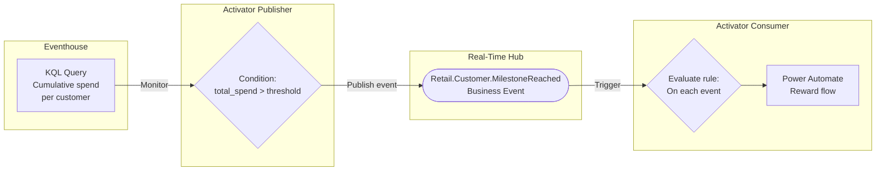
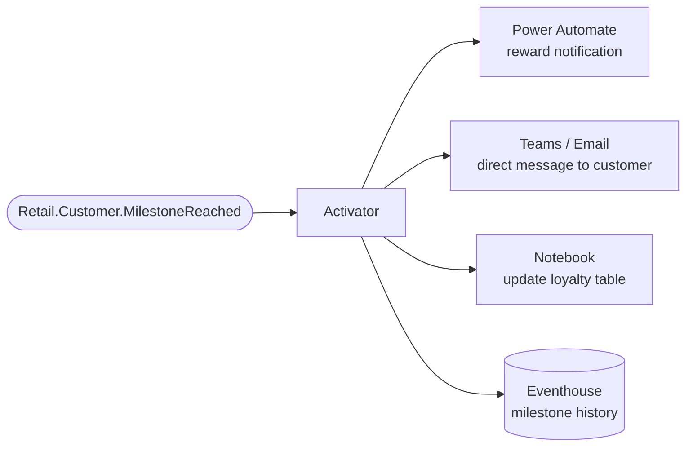

# Scenario 5: Business Automation Loop

**Publisher:** Activator | **Consumer:** Activator

## Business context

A retail company tracks customer spending across all stores. When a customer crosses a loyalty spending milestone, the marketing team wants to trigger a personalized reward automatically, without requiring a human to monitor dashboards or run queries manually.

Activator monitors a KQL query that computes cumulative customer spend. When the threshold is crossed, it publishes a `Retail.Customer.MilestoneReached` Business Event. A second Activator rule subscribes to that event and triggers a Power Automate flow that sends the reward notification and updates the CRM.

**The problem without Business Events:**
The Activator rule that detects the milestone would need to call the Power Automate flow, the CRM API, and the notification service all from the same rule. Adding a new reaction requires modifying the detection rule.

**The solution with Business Events:**
The detection rule publishes one event. Each downstream reaction (reward notification, CRM update, analytics) subscribes independently. The detection logic never changes when reactions change.

## Architecture



## Step 1: Create the Business Event

Before configuring Activator, define the Business Event in Real-Time Hub.

1. Go to [Real-Time Hub → Business Events → Create](https://learn.microsoft.com/en-us/fabric/real-time-hub/business-events/create-business-events).
2. Create or select an Event Schema Set. Use `RetailCustomers` as the schema set name.
3. Name the event `Retail.Customer.MilestoneReached`.
4. In the schema editor, paste the following JSON:

    ```json
    {
      "type": "record",
      "name": "Retail.Customer.MilestoneReached",
      "fields": [
        {
          "name": "customer_id",
          "type": "string",
          "doc": "Unique identifier of the customer"
        },
        {
          "name": "customer_name",
          "type": "string",
          "doc": "Full name of the customer"
        },
        {
          "name": "milestone_tier",
          "type": "string",
          "doc": "Loyalty tier reached: silver, gold, or platinum"
        },
        {
          "name": "total_spend",
          "type": "float",
          "doc": "Cumulative spend amount that triggered this milestone"
        },
        {
          "name": "store_id",
          "type": "string",
          "doc": "Identifier of the store where the milestone was reached"
        },
        {
          "name": "detected_at",
          "type": "string",
          "doc": "Timestamp when the milestone was detected, ISO 8601 format"
        }
      ]
    }
    ```

5. Select **Create**.

## Step 2: Publisher - Activator

Activator monitors a KQL query that computes cumulative customer spend. When the condition is met, it publishes the Business Event. There is no code to write.

### Create the Activator rule

1. In your Fabric workspace, open your KQL Queryset that queries the customer transaction table in your Eventhouse.
2. Write or select a query that returns cumulative spend per customer, for example:

    ```kusto
    transactions
    | summarize total_spend = sum(amount) by customer_id, customer_name, store_id
    | where total_spend > 5000
    ```

3. Select **Set alert** from the KQL Queryset toolbar.
4. In the Activator rule pane, configure the condition:
    - **Monitor**: select the query result field `total_spend`
    - **Condition**: `Becomes greater than`
    - **Value**: `5000`

### Configure the publish action

5. In the **Action** section, select **Publish a business event**.
6. For **Business event**, select `Retail.Customer.MilestoneReached`.
7. Map each schema field to the corresponding query result column or a static value:

    | Schema field | Source |
    |---|---|
    | `customer_id` | `customer_id` column |
    | `customer_name` | `customer_name` column |
    | `milestone_tier` | Static value: `gold` |
    | `total_spend` | `total_spend` column |
    | `store_id` | `store_id` column |
    | `detected_at` | Dynamic: current timestamp |

8. Select **Save** to activate the rule.

For full details on using Activator as a Business Events publisher, see the [Activator publisher documentation](https://learn.microsoft.com/en-us/fabric/real-time-hub/business-events/business-events-activator).

## Step 3: Consumer - Activator

When the `Retail.Customer.MilestoneReached` event is published, a second Activator rule subscribes to it and triggers the reward flow.

### Set up the alert rule

1. In Microsoft Fabric, navigate to **Real-Time** on the left navigation bar.
2. Select **Business events** in Real-Time Hub.
3. Locate the `Retail.Customer.MilestoneReached` event under your schema set.
4. Select **Set alert** from the event options.

### Configure the rule

**Details section**

Enter a name for the rule, for example: `Loyalty Milestone Reward`.

**Monitor section**

1. In the **Source** field, select **Business events**.
2. In the **Connect data source** wizard, select the `Retail.Customer.MilestoneReached` event type.
3. Select **Next**, review the settings, and select **Save**.

**Condition section**

Set **Check** to `On each event`.

**Action section**

1. For **Select action**, choose `Power Automate`.
2. Select or create the Power Automate flow that sends the reward notification and updates the CRM.
3. In **Context**, add `customer_id`, `customer_name`, `milestone_tier`, and `total_spend` so the flow receives the relevant details.

## Step 4: End-to-end test

Once you have the Business Event defined, the Activator publisher rule active, and the consumer rule in place, trigger the flow manually by running the KQL query with a customer that meets the threshold. Then:

1. In Real-Time Hub, select the `Retail.Customer.MilestoneReached` event.
2. Go to the **Publisher** tab and confirm that your Activator rule is listed as an active publisher.
3. Go to the **Data preview** tab and verify that a matching event record appears.
4. Confirm that the Power Automate flow fires and the reward notification is sent.

## What happens next

With the event published, any team can add new reactions independently without touching the detection rule.



| Extension | What it enables |
|---|---|
| **Power Automate** | Send reward email, update CRM, trigger loyalty system |
| **Teams / Email** | Direct notification to a customer success manager |
| **Notebook** | Update the loyalty tier table in your Lakehouse |
| **Eventhouse** | Store milestone history for segment analysis and ML models |
