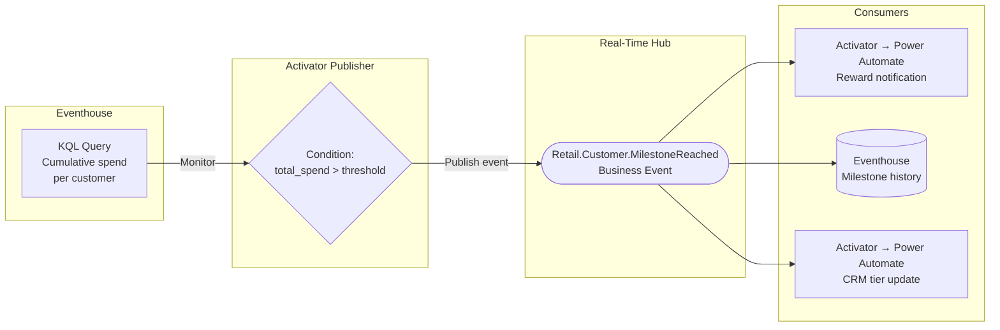

# Scenario 5: Business Automation Loop

**Publisher:** Activator | **Consumer:** Activator

## Business context

A retail company tracks customer spending across all stores. When a customer crosses a loyalty milestone (say, $5,000 in cumulative spend), three things need to happen: marketing sends a personalized reward, the analytics team logs the milestone in Eventhouse, and the CRM is updated with the customer's new loyalty tier.

The challenge is that each team owns a different system and works on a different schedule. If all three are wired into the same Activator rule, any change by one team risks breaking the others. The teams end up coordinating every update instead of working independently.

**The problem without Business Events:**
The only option is a single Activator rule that calls the Power Automate reward flow, writes to Eventhouse, and updates the CRM, all from the same place. When marketing wants to change the reward template, someone has to open the rule. When analytics wants to add a field to the Eventhouse table, someone has to open the rule. One misconfiguration and the milestone goes undetected for every team at once.

**The solution with Business Events:**
Activator detects the milestone and publishes a single `Retail.Customer.MilestoneReached` event. Each team sets up their own subscription. Marketing, analytics, and CRM each receive the same event and act on it independently. The detection logic stays untouched no matter how many teams subscribe or what they do with the event.

## Architecture



## Step 1: Create the Business Event

Before configuring Activator, define the Business Event in Real-Time Hub.

1. Go to [Real-Time Hub → Business Events → Create](https://learn.microsoft.com/en-us/fabric/real-time-hub/business-events/create-business-events).
2. Create or select an Event Schema Set. Use `RetailCustomers` as the schema set name.
3. Name the event `Retail.Customer.MilestoneReached`.
4. In the schema editor, paste the following JSON:

    ```json
    {
      "type": "record",
      "name": "Retail.Customer.MilestoneReached",
      "fields": [
        {
          "name": "customer_id",
          "type": "string",
          "doc": "Unique identifier of the customer"
        },
        {
          "name": "customer_name",
          "type": "string",
          "doc": "Full name of the customer"
        },
        {
          "name": "milestone_tier",
          "type": "string",
          "doc": "Loyalty tier reached: silver, gold, or platinum"
        },
        {
          "name": "total_spend",
          "type": "float",
          "doc": "Cumulative spend amount that triggered this milestone"
        },
        {
          "name": "store_id",
          "type": "string",
          "doc": "Identifier of the store where the milestone was reached"
        },
        {
          "name": "detected_at",
          "type": "string",
          "doc": "Timestamp when the milestone was detected, ISO 8601 format"
        }
      ]
    }
    ```

5. Select **Create**.

## Step 2: Publisher - Activator

Activator monitors a KQL query that computes cumulative customer spend. When the condition is met, it publishes the Business Event. There is no code to write.

### Create the Activator rule

1. In your Fabric workspace, open your KQL Queryset that queries the customer transaction table in your Eventhouse.
2. Write or select a query that returns cumulative spend per customer, for example:

    ```kusto
    transactions
    | summarize total_spend = sum(amount) by customer_id, customer_name, store_id
    | where total_spend > 5000
    ```

3. Select **Set alert** from the KQL Queryset toolbar.
4. In the Activator rule pane, configure the condition:
    - **Monitor**: select the query result field `total_spend`
    - **Condition**: `Becomes greater than`
    - **Value**: `5000`

### Configure the publish action

5. In the **Action** section, select **Publish a business event**.
6. For **Business event**, select `Retail.Customer.MilestoneReached`.
7. Map each schema field to the corresponding query result column or a static value:

    | Schema field | Source |
    |---|---|
    | `customer_id` | `customer_id` column |
    | `customer_name` | `customer_name` column |
    | `milestone_tier` | Static value: `gold` |
    | `total_spend` | `total_spend` column |
    | `store_id` | `store_id` column |
    | `detected_at` | Dynamic: current timestamp |

8. Select **Save** to activate the rule.

For full details on using Activator as a Business Events publisher, see the [Activator publisher documentation](https://learn.microsoft.com/en-us/fabric/real-time-hub/business-events/business-events-activator).

## Step 3: Consumer 1 - Marketing reward (Activator → Power Automate)

1. In Real-Time Hub, locate `Retail.Customer.MilestoneReached` under your schema set.
2. Select **Set alert**.
3. Name the rule `Loyalty Milestone - Reward`.
4. In the **Monitor** section, set **Source** to **Business events** and connect to `Retail.Customer.MilestoneReached`.
5. Set **Condition** to `On each event`.
6. In the **Action** section, select **Power Automate** and connect the flow that sends the reward notification.
7. Add `customer_id`, `customer_name`, and `milestone_tier` as context fields.
8. Select **Save**.

## Step 4: Consumer 2 - Analytics (Eventhouse)

The Eventhouse consumer is enabled at Business Event creation time.

1. In Real-Time Hub, open `Retail.Customer.MilestoneReached`.
2. Select **Analyze in Eventhouse**.
3. Choose a destination KQL database and table name, for example `loyalty_milestones`.
4. Select **Save**.

All published events will be written to this table automatically.

## Step 5: Consumer 3 - CRM tier update (Activator → Power Automate)

Repeat the same steps as Consumer 1 with a different Power Automate flow:

1. In Real-Time Hub, locate `Retail.Customer.MilestoneReached`.
2. Select **Set alert**.
3. Name the rule `Loyalty Milestone - CRM Update`.
4. Set **Condition** to `On each event`.
5. Connect the Power Automate flow that updates the customer's loyalty tier in the CRM.
6. Add `customer_id` and `milestone_tier` as context fields.
7. Select **Save**.

## Step 6: End-to-end test

Trigger the flow manually by running the KQL query with a customer that meets the threshold. Then:

1. In Real-Time Hub, select `Retail.Customer.MilestoneReached`.
2. Go to the **Publisher** tab and confirm that your Activator rule is listed as an active publisher.
3. Go to the **Data preview** tab and verify that a matching event record appears.
4. Confirm that the marketing Power Automate flow fires and the reward notification is sent.
5. Confirm that the `loyalty_milestones` table in Eventhouse has a new row.
6. Confirm that the CRM Power Automate flow fires and the tier is updated.

## Why this matters

Each team controls their own subscription. Marketing can update the reward flow without involving analytics or CRM. Analytics can change the destination table without touching the detection rule. Adding a new team — a customer success manager who wants a Teams notification, for example — means creating one new subscription, nothing else.

