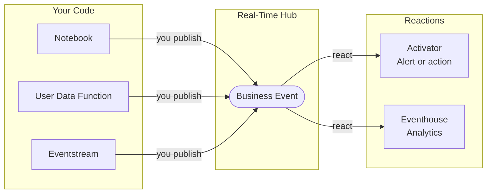
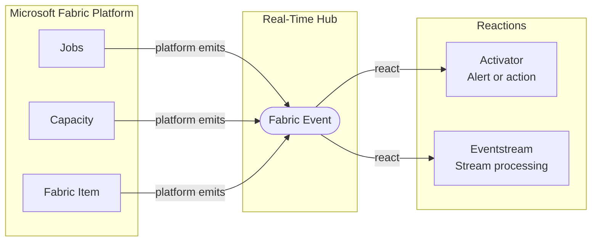
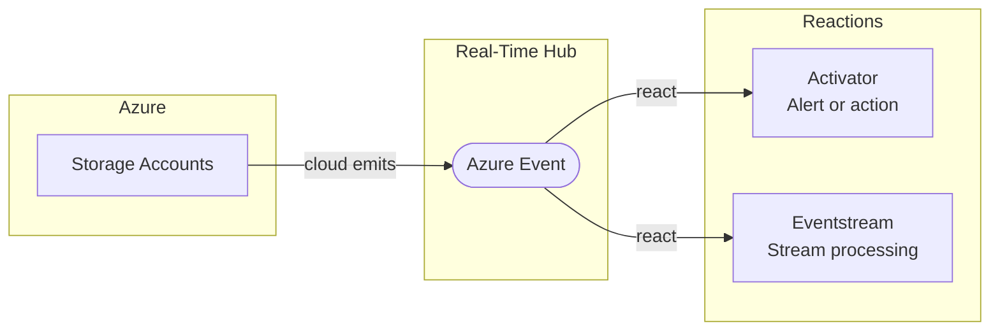

---
hide:
  - navigation
  - toc
---

# Fabric Events

**Event-driven resources for Microsoft Fabric and Azure.**

Microsoft Fabric offers three event pillars for building event-driven solutions — from business signals inside Fabric workloads, to platform-level events across Fabric services, to cloud-scale events in Azure. This site is your developer resource for all three.

This site complements the [official documentation](https://learn.microsoft.com/en-us/fabric/real-time-hub/business-events/business-events-overview) with end-to-end scenarios, real code, and community-driven content.

## Event-driven architecture in Microsoft Fabric

In a traditional data platform, workloads communicate by **polling or direct calls**: a service checks for changes on a schedule, or one workload calls another and waits for a response. This works, but it creates fragile dependencies and wastes compute on work that may find nothing to process.

**Event-driven architecture** inverts this model. Instead of asking "has something changed?", workloads signal "something happened" the moment it occurs. Any interested service reacts immediately, independently, and only when there is real work to do.

### Why it matters for Fabric

Microsoft Fabric is a unified platform where notebooks, pipelines, eventstreams, and analytics workloads run side by side. This creates natural opportunities for event-driven patterns: a notebook that finishes a transformation can signal downstream consumers, a threshold condition in a stream can trigger an alert, a pipeline completion can kick off the next stage automatically.

Without an event model, these interactions require scheduled triggers, hard-coded dependencies, or manual orchestration. With events, each workload stays focused on its own responsibility and reacts to what matters.

**Business Events** are explicitly defined and published by your code. You decide what the event represents, what data it carries, and when it fires.

**Fabric Events** are emitted automatically by the platform. You do not write code to publish them. You only decide how to react when they occur.

**Azure Events** connect Fabric workloads to the broader Azure ecosystem. Azure services publish events that Fabric can consume and react to in real time.

### The cost question

A common concern with event-driven architectures is resource overhead: more services, more moving parts, more cost. In practice, the opposite is often true.

| Pattern | Compute behavior |
|---|---|
| Polling / scheduled | Runs on a fixed schedule regardless of whether there is work to do |
| Direct call | Keeps both services coupled and running during the interaction |
| Event-driven | Each workload activates only when a relevant event occurs |

Event-driven workloads in Fabric consume resources **proportionally to actual activity**. A consumer that reacts to 10 events per day uses a fraction of the compute of a job that polls every 5 minutes around the clock.

## The three pillars

- **Business Events**

    Structured, schema-defined signals published by Fabric workloads (notebooks, user data functions, eventstreams, and activator) and consumed by Activator and Eventhouse in real time.

    [:material-arrow-right: Explore Business Events](../business-events/introduction/what-are-business-events.md)

- **Fabric Events**

    Platform-level events emitted by Microsoft Fabric services, including workspace changes, item lifecycle, and capacity events, enabling reactive architectures across the Fabric ecosystem.

    *Coming soon*

- **Azure Events**

    Cloud-scale eventing with Azure Event Grid, Event Hubs, and Service Bus, integrating Fabric workloads with the broader Azure ecosystem and external systems.

    *Coming soon*

## Where to start

If you are new to event-driven patterns in Microsoft Fabric, start with **Business Events**. It is the most accessible entry point and covers the most common scenarios for data engineers and developers working inside Fabric.

[:material-arrow-right: What are Business Events?](../business-events/introduction/what-are-business-events.md){ .md-button .md-button--primary }
[:material-arrow-right: Browse Scenarios](../business-events/scenarios/index.md){ .md-button }
